# 🎮 RunDev - Survive the Dev Stack


**Live Site:** https://rundev-ms4-2b9a53a2ec26.herokuapp.com  
**Repository:** https://github.com/DonMarcao/RunDev  
**Developer:** Marcus Machado  
**Project Type:** Level 5 Full Stack Web Development - Milestone 4  
**Submission Date:** June 2026

---

## 📸 Screenshots

### Home
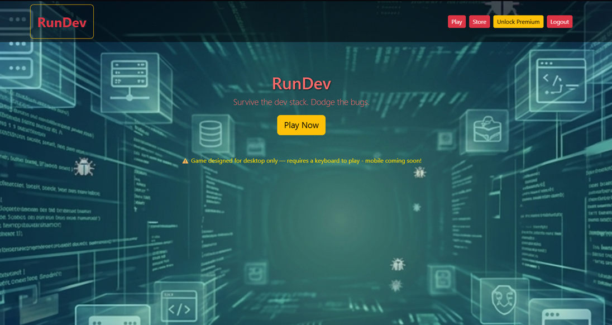

### Game — Web Ocean
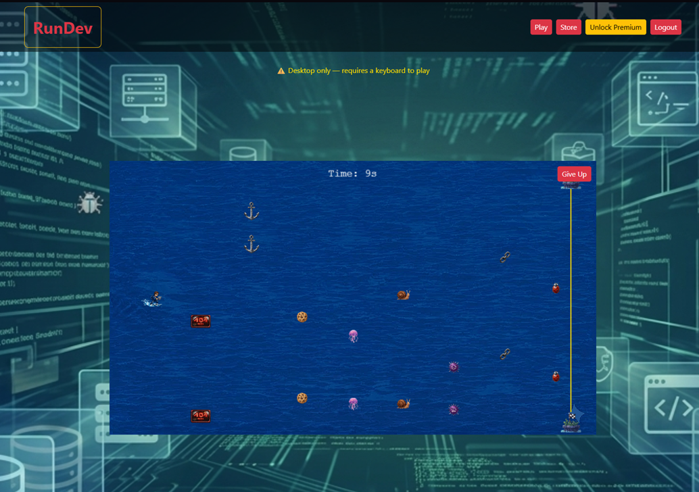

### Game — Cloud City
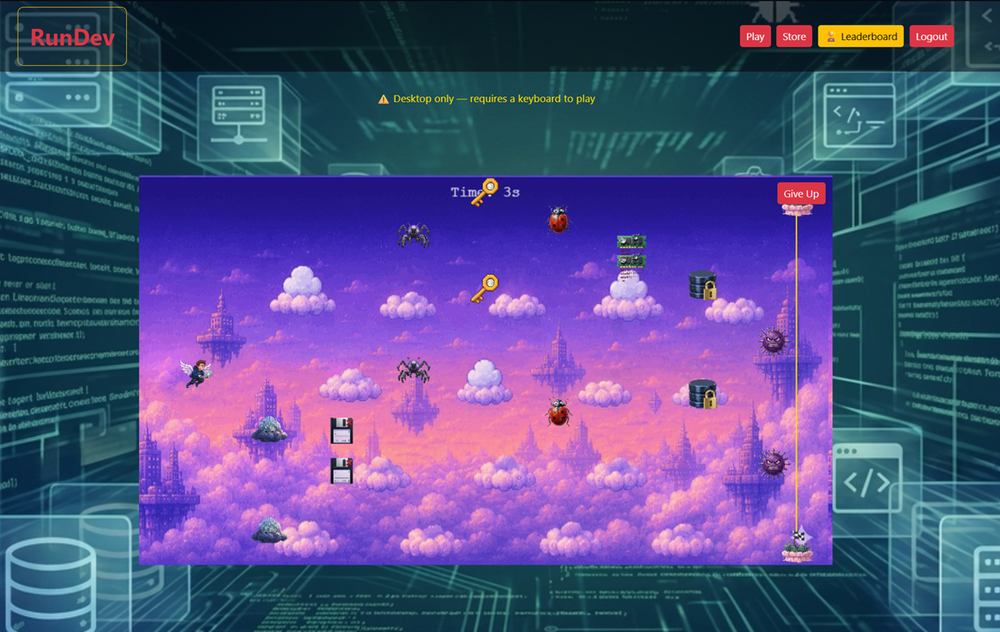

### Showroom
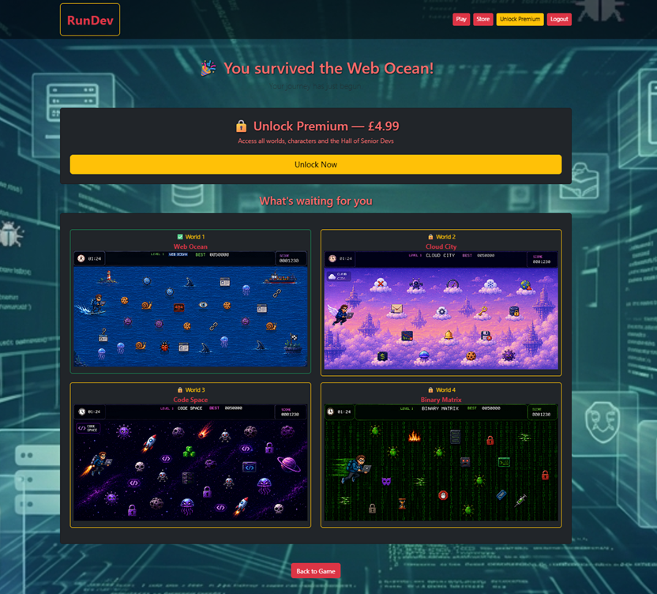

### Leaderboard
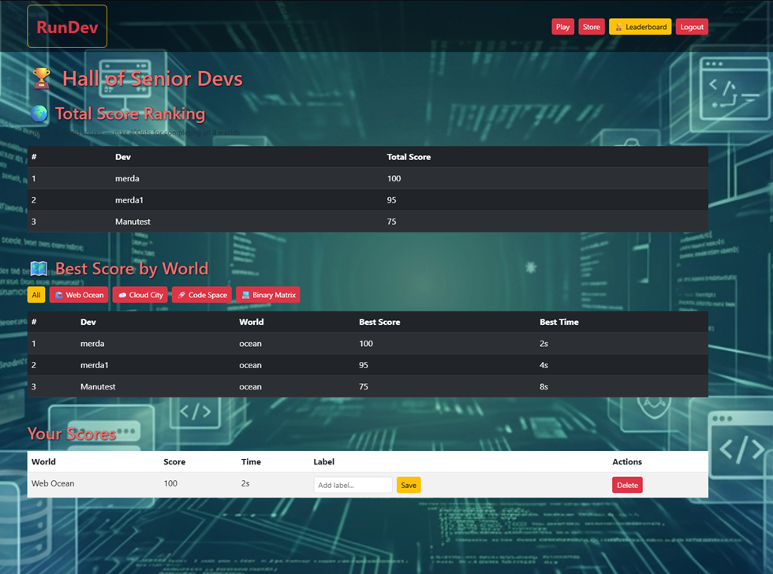

### Store
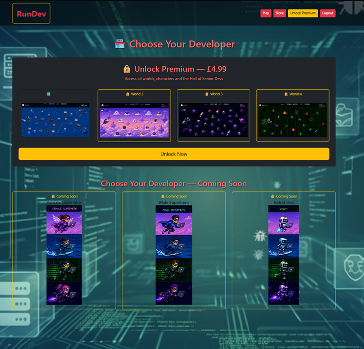

### Checkout
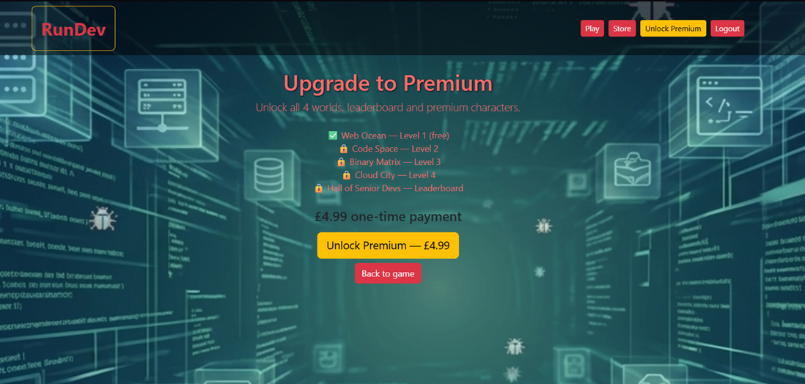

---

## 📋 Table of Contents

1. [Project Overview](#-project-overview)
2. [User Experience Design (UX)](#-user-experience-design-ux)
   - [User Stories](#user-stories)
   - [Design Process](#design-process)
   - [Wireframes](#wireframes)
   - [Color Scheme](#color-scheme)
   - [Typography](#typography)
   - [Database Schema](#database-schema)
3. [Features](#️-features)
   - [Existing Features](#existing-features)
   - [Features Left to Implement](#features-left-to-implement)
4. [Technologies Used](#️-technologies-used)
5. [Deployment](#-deployment)
   - [Heroku Deployment](#heroku-deployment)
   - [Local Development](#local-development)
6. [Development Process](#-development-process)
   - [Version Control Strategy](#version-control-strategy)
7. [Testing](#-testing)
8. [Credits](#-credits)

---

## 🎯 Project Overview

### Overview

**RunDev** is a full-stack browser game built with Django, Phaser 4 and Stripe. Inspired by Frogger, the player must navigate a developer through 4 themed worlds — dodging bugs, errors and tech disasters — from the Web Ocean surface all the way down to the Binary Matrix core.

- **4 Themed Worlds:** Web Ocean → Cloud City → Code Space → Binary Matrix, each with unique sprites, backgrounds and increasing difficulty
- **Freemium Model:** World 1 is free to play. Premium access (£4.99) unlocks all 4 worlds and the leaderboard
- **Score System:** 100pts for completion under 3 seconds, -5pts per second after, minimum 50pts
- **Hall of Senior Devs:** Premium-only leaderboard where players manage their scores (full CRUD)
- **Stripe Integration:** End-to-end payment flow with webhook support
- **Progression System:** Completing each premium world unlocks the next world and its developer character

### Project Purpose

Developed as part of the Level 5 Diploma in Full Stack Web Development, demonstrating:

✅ **Backend Development** (Python, Django, PostgreSQL)  
✅ **User Authentication** (Django auth, session management)  
✅ **Database Design** (Relational models, migrations)  
✅ **CRUD Operations** (Full create/read/update/delete on Score model)  
✅ **Payment Integration** (Stripe checkout, webhook, success/cancel flows)  
✅ **Game Development** (Phaser 4, sprite management, collision detection)  
✅ **Deployment** (Heroku, WhiteNoise, dj-database-url)  
✅ **Automated Testing** (31 unit tests across all apps)  
✅ **Code Quality** (PEP8 compliant)

### Target Audience

1. **Developers and Students:** People who will appreciate the tech humour of dodging 404 errors, SQL injections and memory leaks
2. **Casual Gamers:** Anyone who enjoys a quick, challenging browser game
3. **Code Institute Community:** Fellow students and assessors who will recognise the Milestone progression narrative

---

## 👥 User Experience Design (UX)

### User Stories

#### 🔐 Authentication

| # | Story | Status |
|---|-------|--------|
| 1 | As a user, I want to register for an account so that I can save my scores and access premium content. | ✅ |
| 2 | As a user, I want to log in with my username and password so that I can access my account. | ✅ |
| 3 | As a user, I want to log out so that my account is secure. | ✅ |

#### 🎮 Game

| # | Story | Status |
|---|-------|--------|
| 4 | As a player, I want to play World 1 for free so that I can try the game before purchasing. | ✅ |
| 5 | As a player, I want to navigate my developer using arrow keys so that I can dodge obstacles. | ✅ |
| 6 | As a player, I want to see my time so that I can try to beat my score. | ✅ |
| 7 | As a player, I want to see my score when I complete a level so that I know how well I did. | ✅ |
| 8 | As a player, I want to restart the game after game over so that I can try again. | ✅ |

#### 💳 Premium

| # | Story | Status |
|---|-------|--------|
| 9 | As a free user, I want to see a showroom after completing World 1 so that I can decide if Premium is worth it. | ✅ |
| 10 | As a user, I want to pay £4.99 securely via Stripe so that I can unlock all 4 worlds. | ✅ |
| 11 | As a premium user, I want to be taken to the next world automatically after completing one so that the progression feels seamless. | ✅ |

#### 🏆 Leaderboard & CRUD

| # | Story | Status |
|---|-------|--------|
| 12 | As a premium user, I want to view the Hall of Senior Devs so that I can compare my scores with others. | ✅ |
| 13 | As a premium user, I want to add a label to my scores so that I can remember memorable runs. | ✅ |
| 14 | As a premium user, I want to delete scores I am not proud of so that I can manage my history. | ✅ |

#### 🔮 V2 (Future)

| # | Story | Status |
|---|-------|--------|
| 15 | As a premium user, I want to select my developer character before playing so that I can personalise my experience. | 🔜 |
| 16 | As a mobile user, I want to play using on-screen controls so that I can play without a keyboard. | 🔜 |

---

### Design Process

#### Planning

The project was planned with a freemium game model in mind from the start. Data models, user stories, ERD and wireframes were all produced before any code was written. The game mechanic was inspired by Frogger — rotated 90° so the player moves left-to-right while obstacles move up and down in vertical lanes.

#### Key Design Decisions

**Game Engine — Phaser 4**

Kaboom.js was initially considered but abandoned due to lack of active maintenance. A pure Canvas approach was also prototyped but proved too time-consuming for the scope. Phaser 4 was chosen for its active community, Frogger tutorial availability and clean scene/preload/create/update lifecycle that maps well to Django's MVC pattern.

**CRUD on Score Model**

CRUD operations are implemented on the Score model via the leaderboard. Users can create scores by completing worlds, read all scores on the leaderboard, update labels on individual scores and delete scores they no longer want. This was the cleanest implementation of CRUD that felt natural to the product rather than forced.

**Freemium Progression**

The progression system was designed so that each unlock has real meaning:
- Free play → World 1 only
- £4.99 → World 2 + Dev 2 unlocked immediately
- Complete World 2 → World 3 + Dev 3 unlocked
- Complete World 3 → World 4 + Dev 4 unlocked
- Complete World 4 → Hall of Senior Devs

**Character Selector — V2**

A character selector was planned but moved to V2 to avoid scope creep. The store currently shows all developer characters as "coming soon". Each world already has its own developer sprite assigned automatically based on the current world.

**Mobile Support — Desktop-Only by Design**

The game requires keyboard input (arrow keys) which makes it desktop-only by design. A disclaimer (⚠️ Desktop only — requires a keyboard to play) is displayed on both the Home page and the Game page to set expectations before play. All Django pages (home, leaderboard, store, checkout) remain fully responsive via Bootstrap 5. Mobile on-screen controls are planned for V2.

---

### Wireframes

Wireframes produced before development as part of the UX planning phase.

#### Home


#### Login


#### Register


#### Game


#### Showroom


#### Leaderboard


#### Store


#### Checkout


---

### Color Scheme

The visual design uses the game background image as the primary design anchor — a dark tech-themed illustration that gives the site a consistent identity across all pages.

```css
/* Navbar */
background: #212529;  /* Bootstrap dark */

/* Game canvas */
transparent: true;    /* Phaser canvas over looping WebM video background */

/* Worlds */
Web Ocean:      Deep blue ocean
Cloud City:     Purple/pink sky
Code Space:     Deep space dark
Binary Matrix:  Matrix green on black
```

---

### Typography

**Font:** Bootstrap 5 default system font stack  
**Game HUD:** Phaser default (sans-serif)

---

### Database Schema

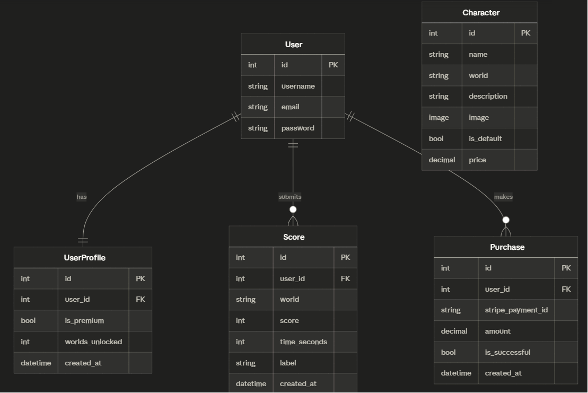

| Model | Key Fields |
|-------|-----------|
| **User** | id, username, email, password (Django built-in) |
| **UserProfile** | user (FK), is_premium, worlds_unlocked, created_at |
| **Score** | user (FK), world, score, time_seconds, label, created_at |
| **Character** | name, world, description, image, is_default, price |
| **Purchase** | user (FK), stripe_payment_id, amount, is_successful, created_at |

**Relationships:**
- User → UserProfile (one-to-one)
- User → Score (one-to-many)
- User → Purchase (one-to-many)
- Character is a standalone catalogue (no FK to User — character selector is V2)

**Known Limitation:** Purchase does not store which specific product was bought because RunDev currently has only one product (Premium Access). This will be revisited when individual character purchases are implemented in V2.

---

## ⚙️ Features

### Existing Features

#### 1. 🔐 User Authentication
- Register, login, logout
- Django session management
- `@login_required` decorator on all game, leaderboard and payment views
- Automatic redirect to login for unauthenticated users

#### 2. 🎮 Game — 4 Worlds
- Phaser 4 game engine with transparent canvas over looping WebM video backgrounds
- Player moves with arrow keys across 8 vertical obstacle lanes
- 2 obstacles per lane with alternating directions
- Per-world sprite sets, player sprites, finish line markers and speed configuration
- Dynamic world loading — single `game.js` handles all 4 worlds via `WORLD_CONFIG`
- Timer with delta time (accurate frame-rate-independent counting)
- Score calculation — 100pts under 3 seconds, -5pts/second after, minimum 50pts

#### 3. 💰 Freemium & Stripe
- World 1 free for all registered users
- Stripe Checkout integration (£4.99 one-time payment)
- Webhook handler updates `is_premium` and `worlds_unlocked` on payment success
- Free user redirected to Showroom after completing World 1
- Premium user progresses through worlds automatically

#### 4. 🏆 Leaderboard — Hall of Senior Devs
- Premium-only access (free users see locked page with upgrade CTA)
- Global rankings table (top 20 scores across all worlds)
- Personal scores section with full CRUD:
  - **Create** — score submitted automatically after level complete
  - **Read** — all scores visible on leaderboard
  - **Update** — user can edit label/nickname on any of their scores
  - **Delete** — user can delete any of their own scores
- "Thanks for playing" banner shown after completing all 4 worlds

#### 5. 🏪 Store
- Two-row layout: Worlds (unlock status) and Developers (coming soon)
- World 1 shown as Free, Worlds 2-4 shown as Premium
- All developer characters shown as Coming Soon
- Navbar CTA for free users to upgrade

#### 6. 🎬 Showroom
- Shown to free users after completing World 1
- Score and time from the completed run
- Preview of all 4 worlds and 4 developer characters
- Premium upgrade CTA (£4.99)

#### 7. 🎨 UI & UX
- Full-screen background image across all Django pages
- Looping WebM video backgrounds per world in game canvas
- Flash messages for auth actions
- Bootstrap 5 responsive layout

### Known Issues

- **Game Over / Level Complete overlap (rare)** — In rare cases, if the player crosses the finish line at the exact same frame an obstacle collision is detected, both the "Game Over" and "Level Complete" messages can render simultaneously. The win condition is checked before the collision check to minimise this, but the edge case can still occur under specific timing. This does not affect score submission or game functionality, and is difficult to reproduce intentionally. Flagged here for transparency rather than left undocumented.

- **Background video distortion after GIF → WebM conversion (resolved)** — After converting the world backgrounds from GIF to WebM to reduce asset size, the videos appeared visibly squashed inside the game canvas, with empty space showing around the edges on all four worlds. Investigation with `ffprobe` showed the video files were encoded at the correct 960x540 pixel resolution, but carried an incorrect Sample Aspect Ratio (SAR) in their metadata (e.g. `1093:960` instead of `1:1`) — a side effect of the conversion process. This caused browsers to apply automatic letterboxing based on the (incorrect) stored aspect ratio rather than the actual pixel dimensions. Fixed by re-encoding all four background videos with `ffmpeg` using `-vf "setsar=1:1"` to force a 1:1 pixel aspect ratio, restoring the correct 16:9 display ratio with no visible quality loss or file size increase.

### Features Left to Implement

- **Character Selector** — Choose your developer before playing (V2)
- **Mobile Controls** — On-screen arrow buttons for mobile play (V2)
- **Multi-world Leaderboard Filter** — Filter Hall of Senior Devs by world (V2)
- **World Preview Animations** — Animated previews in Showroom (V2)
- **Social Login** — Google/GitHub OAuth (V2)

---

## 🛠️ Technologies Used

### Languages
- **Python 3** — Backend logic
- **JavaScript** — Phaser 4 game engine, CSRF handling, fetch API
- **HTML5** — Django templates
- **CSS3** — Custom styles

### Frameworks & Libraries
- **Django 6** — Full-stack web framework
- **Phaser 4** — Browser game engine (CDN)
- **Bootstrap 5.3** — Responsive UI components
- **Stripe** — Payment processing
- **psycopg2** — PostgreSQL adapter
- **WhiteNoise** — Static files in production
- **dj-database-url** — Database URL parsing for Heroku
- **django-environ** — Environment variable management

### Database
- **PostgreSQL** — Production (Heroku)
- **SQLite** — Local development

### Tools & Programs
- **VSCode** — Code editor
- **Git & GitHub** — Version control
- **Heroku** — Cloud deployment
- **ChatGPT / Gemini** — AI-generated game sprites
- **remove.bg** — Background removal for sprites
- **ffmpeg** — Video format conversion and aspect ratio correction
- **W3C Validator** — HTML/CSS validation
- **dbdiagram.io** — ERD creation

---

## 🚀 Deployment

### Heroku Deployment

**Live Site:** https://rundev-ms4-2b9a53a2ec26.herokuapp.com

#### Pre-Deployment Checklist

- [x] `requirements.txt` updated (`pip freeze > requirements.txt`)
- [x] `Procfile` created (`web: gunicorn rundev.wsgi`)
- [x] `runtime.txt` created
- [x] WhiteNoise configured in `MIDDLEWARE` and `STATICFILES_STORAGE`
- [x] `dj-database-url` configured — SQLite local, PostgreSQL production
- [x] `DEBUG=False` for production
- [x] `ALLOWED_HOSTS` includes Heroku URL
- [x] All environment variables set as Heroku config vars
- [x] Static files collected (`python manage.py collectstatic`)
- [x] Migrations run on production database

#### Deployment Steps

```bash
# 1. Install Heroku CLI and login
heroku login

# 2. Create Heroku app
heroku create rundev-ms4

# 3. Add PostgreSQL addon
heroku addons:create heroku-postgresql:essential-0

# 4. Set environment variables
heroku config:set SECRET_KEY=your-secret-key
heroku config:set DEBUG=False
heroku config:set ALLOWED_HOSTS=your-app.herokuapp.com
heroku config:set STRIPE_PUBLIC_KEY=pk_live_...
heroku config:set STRIPE_SECRET_KEY=sk_live_...
heroku config:set STRIPE_WEBHOOK_SECRET=whsec_...

# 5. Deploy
git push heroku main

# 6. Run migrations
heroku run python manage.py migrate

# 7. Collect static files
heroku run python manage.py collectstatic

# 8. Create superuser
heroku run python manage.py createsuperuser
```

#### Environment Variables

| Variable | Description |
|----------|-------------|
| `SECRET_KEY` | Django secret key |
| `DEBUG` | `False` in production |
| `ALLOWED_HOSTS` | Heroku app URL |
| `DATABASE_URL` | Set automatically by Heroku PostgreSQL addon |
| `STRIPE_PUBLIC_KEY` | Stripe publishable key |
| `STRIPE_SECRET_KEY` | Stripe secret key |
| `STRIPE_WEBHOOK_SECRET` | Stripe webhook signing secret |

---

### Local Development

#### Requirements

- Python 3.12+
- PostgreSQL (optional — SQLite used by default locally)
- Git

#### Setup

```bash
# Clone repository
git clone https://github.com/DonMarcao/RunDev.git
cd RunDev

# Create virtual environment
python -m venv venv
venv\Scripts\activate  # Windows
source venv/bin/activate  # Mac/Linux

# Install dependencies
pip install -r requirements.txt

# Create .env file
SECRET_KEY=your-secret-key
DEBUG=True
ALLOWED_HOSTS=localhost,127.0.0.1
DATABASE_URL=
STRIPE_PUBLIC_KEY=pk_test_...
STRIPE_SECRET_KEY=sk_test_...
STRIPE_WEBHOOK_SECRET=whsec_...

# Run migrations
python manage.py migrate

# Create superuser
python manage.py createsuperuser

# Start server
python manage.py runserver
```

#### File Structure

```
MS4/
├── accounts/               # Authentication app
│   ├── models.py           # UserProfile model
│   ├── views.py            # Register, login, logout
│   └── tests.py            # 8 automated tests
├── game/                   # Game app
│   ├── views.py            # game_view, submit_score, showroom_view
│   ├── urls.py
│   └── tests.py            # 8 automated tests
├── leaderboard/            # Leaderboard app
│   ├── models.py           # Score model
│   ├── views.py            # leaderboard_view, update_score, delete_score
│   └── tests.py            # 9 automated tests
├── payments/               # Payments app
│   ├── models.py           # Purchase model
│   ├── views.py            # checkout, success, cancel, webhook
│   └── tests.py            # 6 automated tests
├── store/                  # Store app
│   └── views.py            # store_view
├── templates/
│   ├── base.html           # Global template with navbar
│   ├── home.html
│   ├── accounts/           # login, register templates
│   ├── game/               # game.html, showroom.html
│   ├── leaderboard/        # leaderboard.html, locked.html
│   ├── payments/           # checkout, success, cancel templates
│   └── store/              # store.html
├── static/
│   ├── assets/
│   │   ├── background/     # Looping WebM video backgrounds per world
│   │   ├── devs/           # Player sprites (oc_dev, cc_dev, cs_dev, bm_dev)
│   │   ├── elements/       # Obstacle sprites per world (oc_, cc_, cs_, bm_)
│   │   └── ui/             # bg_main.png global background
│   ├── assets/game.js      # Phaser 4 game logic
│   └── css/style.css       # Global stylesheet
├── rundev/
│   ├── settings.py
│   └── urls.py
├── docs/
│   ├── erd_diagram.png
│   └── wireframes/
├── .env                    # Environment variables (not committed)
├── Procfile
├── requirements.txt
├── runtime.txt
├── manage.py
├── README.md
└── TESTING.md
```

---

## 📝 Development Process

### Version Control Strategy

**Repository:** https://github.com/DonMarcao/RunDev  
**Primary Branch:** `main`  
**Commit Philosophy:** Small, focused commits per feature

#### Commit Message Convention

| Type | Purpose | Example |
|------|---------|---------|
| **feat** | New feature | `feat: add stripe checkout flow` |
| **fix** | Bug fix | `fix: win condition before collision check` |
| **style** | CSS/UI changes | `style: add background image to all pages` |
| **refactor** | Code restructure | `refactor: dynamic world system in game.js` |
| **docs** | Documentation | `docs: add testing documentation` |
| **test** | Testing updates | `test: add automated tests for leaderboard app` |

---

## 🧪 Testing

**Comprehensive testing documentation:** [TESTING.md](TESTING.md)

### Code Validation Summary

Every language used in the project was validated with an appropriate tool:

| Language | Tool | Result |
|----------|------|--------|
| HTML | [W3C Markup Validator](https://validator.w3.org/) | ✅ 0 errors (9 pages) |
| CSS | [W3C CSS Validator](https://jigsaw.w3.org/css-validator/) | ✅ 0 errors |
| JavaScript | [ESLint](https://eslint.org/) | ✅ 0 errors, 0 warnings |
| Python | [pycodestyle](https://pycodestyle.pycqa.org/) (PEP8) | ✅ 0 errors |

Full validation details and screenshots in [TESTING.md](TESTING.md#code-validation).

### Automated Tests

```bash
python manage.py test
```

| App | Tests | Status |
|-----|-------|--------|
| accounts | 8 | ✅ Pass |
| game | 8 | ✅ Pass |
| leaderboard | 9 | ✅ Pass |
| payments | 6 | ✅ Pass |
| **Total** | **31** | **✅ All passing** |

### W3C Validation

#### Home
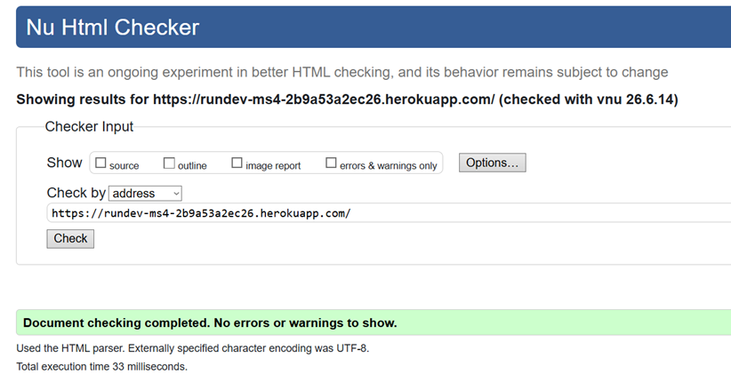

#### Login
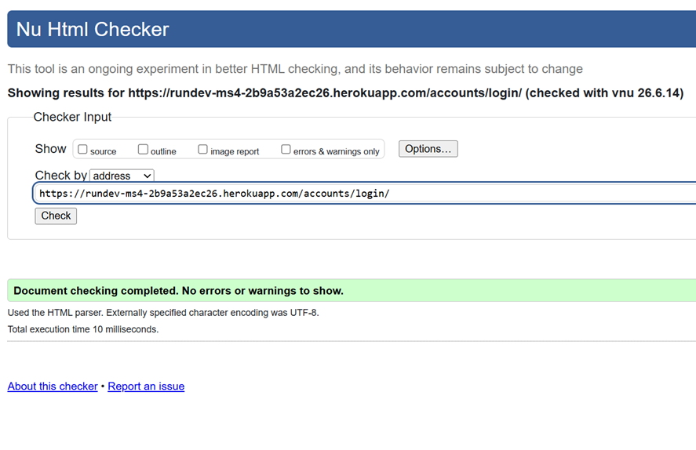

#### Register
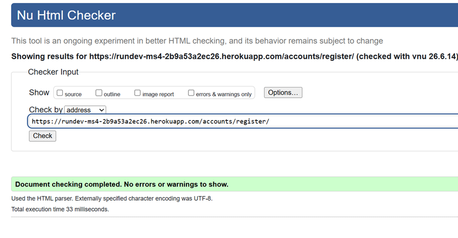

#### Game
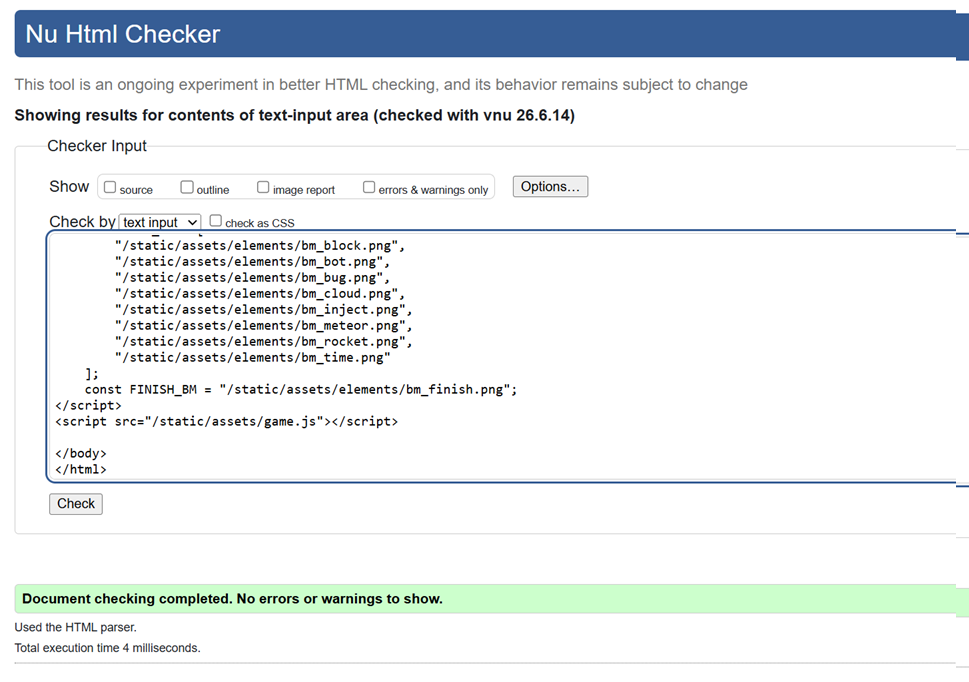

#### Showroom
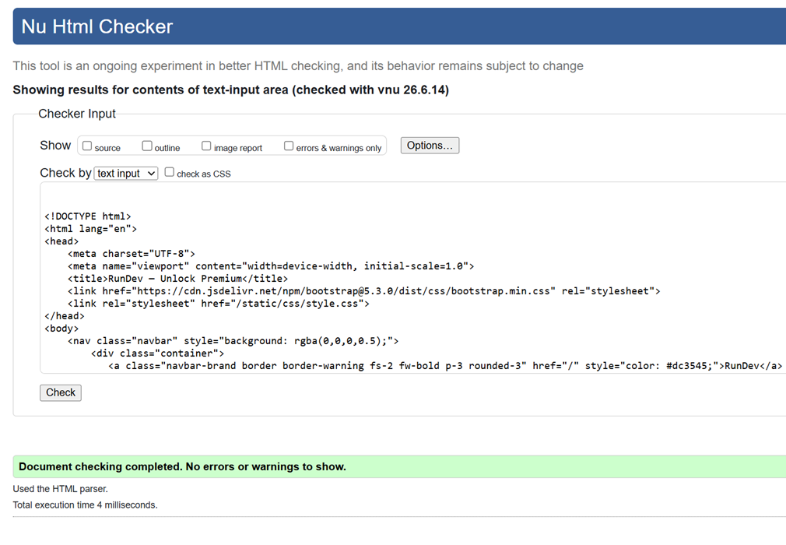

#### Leaderboard
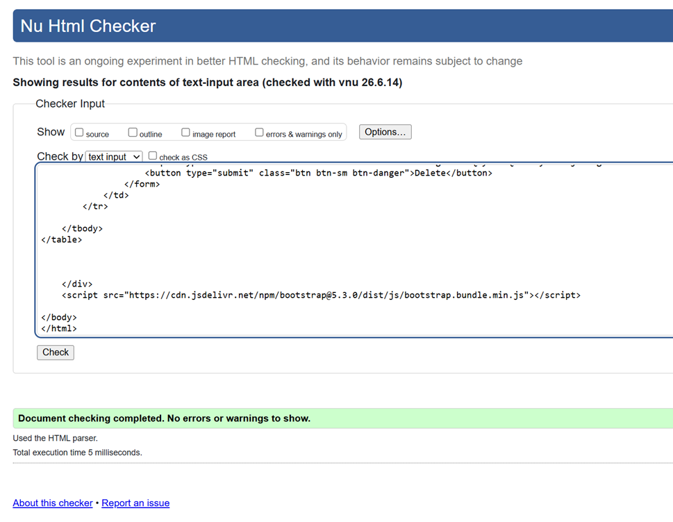

#### Store
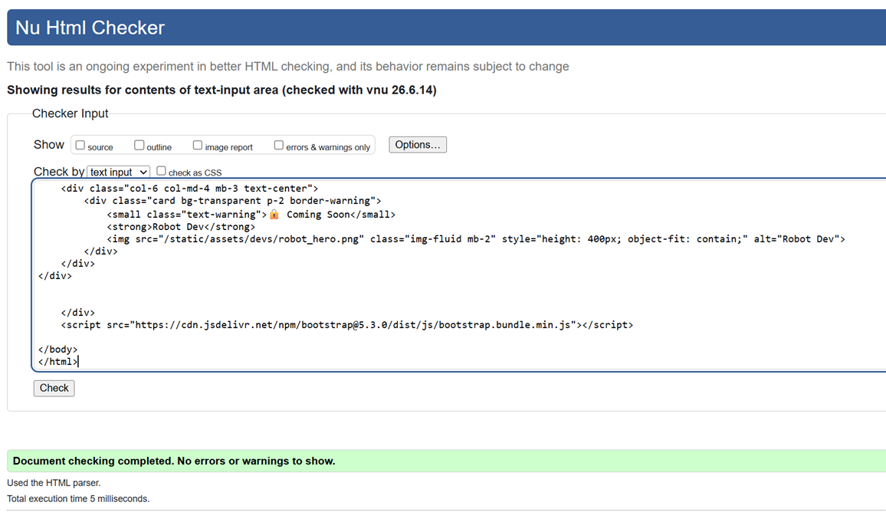

#### Checkout
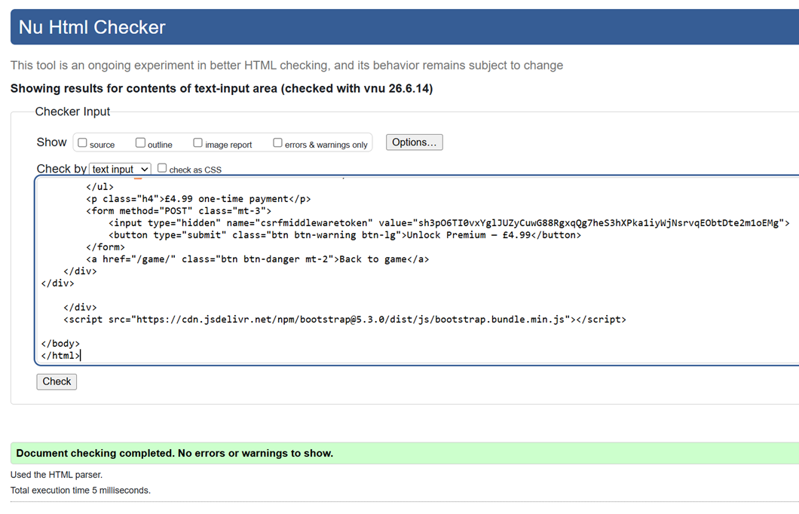

#### CSS
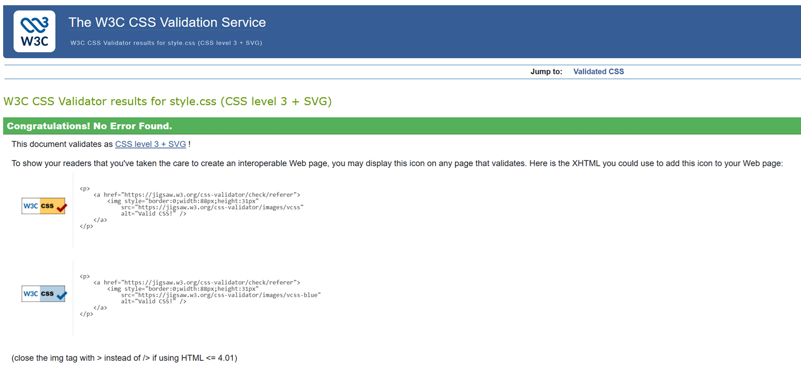

### Lighthouse Scores

| Page | Mobile Performance | Desktop Performance | Accessibility | Best Practices | SEO |
|------|--------------------|--------------------|----------------|-----------------|-----|
| Home | 98 | 100 | 100 | 100 | 100 |
| Game | 87 | 91 | 100 | 100 | 100 |

Screenshots: [Home Desktop](docs/lighthouse/home_desktop_lighthouse.png) | [Home Mobile](docs/lighthouse/home_mobile_lighthouse.png) | [Game Desktop](docs/lighthouse/game_desktop_lighthouse.png) | [Game Mobile](docs/lighthouse/game_mobile_lighthouse.png)

**Note on Game page performance:** The Game page initially scored 72 (desktop) / 82 (mobile) due to large GIF background assets (50MB+ total across 4 worlds). This was resolved by converting all world backgrounds from GIF to WebM video format, reducing total background asset size from ~50MB to under 400KB combined, which brought desktop performance to 89. A further Lighthouse audit identified the global `bg_main.png` background image (used across all pages, 1.68MB) as the largest remaining opportunity, estimated at ~1.5MB of potential savings. Compressing it to an optimised JPEG (164KB, ~90% size reduction, quality 80) pushed desktop performance to **91** and mobile to **87**. The remaining gap on mobile is primarily due to the size of the Phaser 4 game engine bundle (1.2MB) loaded from CDN, which has a proportionally larger impact under Lighthouse's simulated mobile network/CPU throttling. Since the game is explicitly disclaimed as desktop-only (keyboard-required), this was considered an acceptable trade-off.

---

## 🙏 Credits

### Code Attribution

**Phaser 4**
- Framework: Phaser by Photon Storm
- License: MIT
- Source: https://phaser.io/
- Usage: Browser game engine — scene lifecycle, sprite management, collision detection, keyboard input

**Stripe**
- Library: stripe-python
- License: MIT
- Source: https://stripe.com/docs/api
- Usage: Payment checkout, webhook handling, premium unlock

**Bootstrap 5.3**
- Framework: Bootstrap
- License: MIT
- Source: https://getbootstrap.com/
- Usage: Responsive UI components across all pages

**dj-database-url**
- Library: dj-database-url
- License: BSD
- Source: https://github.com/jazzband/dj-database-url
- Usage: Heroku PostgreSQL URL parsing

**WhiteNoise**
- Library: WhiteNoise
- License: MIT
- Source: http://whitenoise.evans.io/
- Usage: Static file serving in production

**django-environ**
- Library: django-environ
- License: MIT
- Source: https://django-environ.readthedocs.io/
- Usage: Environment variable management via .env file

### Assets

**Game Sprites**
- All game sprites (player characters, obstacles, finish line markers) generated using ChatGPT image generation
- Background removal performed using remove.bg
- Animated world backgrounds generated using Google Gemini, converted from GIF to WebM video format using ffmpeg for performance optimisation

### Original Implementation

All application logic, features and implementations created by Marcus Machado, including:
- Django models, views, URL configuration across 5 apps
- Phaser 4 game engine integration with Django template variables
- Dynamic world configuration system (WORLD_CONFIG)
- Freemium progression logic (world unlocking via Stripe webhook)
- Score CRUD implementation on leaderboard
- Stripe checkout, success, cancel and webhook flows
- Per-world sprite management and scaling system
- Bootstrap 5 responsive layout and custom CSS
- Heroku deployment configuration with PostgreSQL

### Acknowledgments

- **Code Institute** — Level 5 Full Stack Web Development course
- **Django Documentation** — https://docs.djangoproject.com/
- **Phaser Documentation** — https://newdocs.phaser.io/
- **Stripe Documentation** — https://stripe.com/docs/
- **Bootstrap Documentation** — https://getbootstrap.com/docs/
- **Stack Overflow Community** — Problem-solving assistance

---

## 📄 License

MIT License — Copyright (c) 2026 Marcus Machado

---

**Developer:** Marcus Machado  
**GitHub:** [@DonMarcao](https://github.com/DonMarcao)  
**Status:** ✅ Live on Heroku

---

⭐ **[View Complete Testing Documentation →](TESTING.md)** ⭐